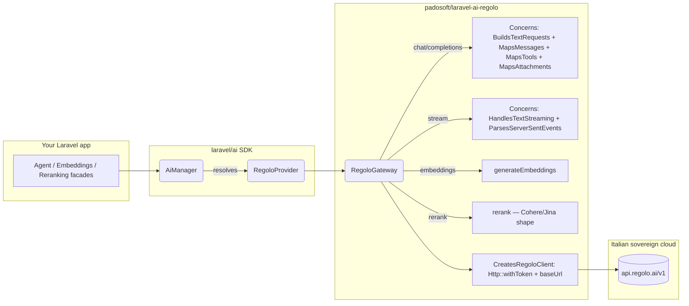

<h1 align="center">laravel-ai-regolo</h1>

<p align="center">
  <strong>The fastest way to ship a Laravel app on Italian sovereign AI infrastructure.</strong><br/>
  A first-class <a href="https://regolo.ai">Seeweb Regolo</a> provider for the official <a href="https://github.com/laravel/ai"><code>laravel/ai</code></a> SDK — chat, embeddings, reranking, plus a 30+ open-model catalog hosted entirely in Italy.
</p>

<p align="center">
  <a href="https://github.com/padosoft/laravel-ai-regolo/actions/workflows/ci.yml"></a>
  <a href="https://packagist.org/packages/padosoft/laravel-ai-regolo"></a>
  <a href="https://packagist.org/packages/padosoft/laravel-ai-regolo"></a>
  <a href="LICENSE"></a>
  
  
  <a href="https://github.com/padosoft/laravel-ai-regolo/issues"></a>
</p>

---

## Table of contents

1. [Why this package](#why-this-package)
2. [Design rationale](#design-rationale)
3. [Features at a glance](#features-at-a-glance)
4. [Comparison vs alternatives](#comparison-vs-alternatives)
5. [Installation](#installation)
6. [Quick start](#quick-start)
7. [Usage examples](#usage-examples)
8. [Configuration reference](#configuration-reference)
9. [Architecture](#architecture)
10. [Testing](#testing)
11. [Roadmap](#roadmap)
12. [Contributing](#contributing)
13. [Security](#security)
14. [License & credits](#license--credits)

---

## Why this package

`laravel/ai` is the official Laravel AI SDK, and it ships 14+ providers out of the box (OpenAI, Anthropic, Gemini, Mistral, Groq, Cohere, DeepSeek, Bedrock, Azure OpenAI, OpenRouter, Ollama, Jina, VoyageAI, xAI, ElevenLabs).

What it **does not ship** is a provider for [**Regolo**](https://regolo.ai) — Seeweb's Italian sovereign AI cloud. Regolo gives you:

- A growing catalog of **30+ open models** hosted in Italy (Llama 3, Qwen, Mistral, Gemma, Phi, DeepSeek, ...).
- **Chat + embeddings + reranking** under a single API.
- **GDPR + EU AI Act-friendly** hosting — your traffic and your customers' data never leave the EU.
- **Pay-as-you-go pricing** competitive with US-hosted providers, billed in EUR.
- A REST surface that is **OpenAI-compatible** for chat and embeddings (and Cohere/Jina-shaped for reranking), so the same prompts and tooling that work against OpenAI work against Regolo with one config change.

This package fills the gap. Drop it in alongside `laravel/ai`, set a single env var, and Regolo becomes available through the same unified `Agent::for()` / `Embeddings::for()` / `Reranking::of()` APIs the SDK already exposes — no adapter, no wrapper, no learning curve.

> **Italian sovereign cloud, official Laravel API, zero leakage of provider concepts into your domain code.**

## Design rationale

A few decisions are worth surfacing up front, because they shape the package's footprint and the kind of bugs you can or cannot have.

### 1. Provider extension, not SDK fork

`laravel/ai` is a young but well-architected SDK. Forking it to add Regolo would split the ecosystem and force consumers to choose. Instead, this package implements the **public capability contracts** (`TextProvider`, `EmbeddingProvider`, `RerankingProvider`) and the **public gateway contracts** (`TextGateway`, `EmbeddingGateway`, `RerankingGateway`). A single `Padosoft\LaravelAiRegolo\LaravelAiRegoloServiceProvider` registers the binding `ai.provider.regolo`, and the SDK takes it from there.

The blast radius is small: when `laravel/ai` ships a new minor version, you get the upgrade for free; only a contract change in those interfaces would force a release here.

### 2. OpenAI-classic, not OpenAI-Responses

The upstream `OpenAiGateway` targets OpenAI's newer Responses API (`POST /v1/responses`). Regolo is OpenAI-compatible on the **classic** Chat Completions surface (`POST /v1/chat/completions`). The closest upstream template is therefore `MistralGateway` — we mirror its concern split (`BuildsTextRequests` / `MapsMessages` / `MapsTools` / `MapsAttachments` / `HandlesTextStreaming` / `ParsesTextResponses`) and adapt only the namespace and the provider name in the validation exception. See [`docs/laravel-ai-integration-notes.md`](docs/laravel-ai-integration-notes.md) for the full audit.

### 3. Stateless gateway, configuration on the provider

`RegoloGateway::__construct(Dispatcher $events)` takes only the event dispatcher. Credentials and base URL are read from the `Provider` argument on each call via `providerCredentials()['key']` and `additionalConfiguration()['url']`. Two consequences:

- The same gateway instance is safe to share across configurations or to bind as a singleton.
- Rotating an API key or pointing at a staging endpoint is a `config()` change, not a service-provider rebuild.

### 4. Standalone, agnostic

The package has zero dependencies on AskMyDocs, Padosoft proprietary code, or any sister package. It works in any Laravel 11 / 12 / 13 application that has `laravel/ai` installed. The reverse is true too: `lopadova/askmydocs` and `padosoft/askmydocs-pro` consume this package, never the inverse.

## Features at a glance

- **Chat completion + streaming** via `Agent::for(...)->using('regolo', $model)->prompt()` and `->stream()`.
- **Embeddings** via `Embeddings::for($inputs)->generate('regolo', $model)`.
- **Reranking** via `Reranking::of($docs)->limit($k)->rerank($query, 'regolo', $model)`.
- **Open-model catalog** with Italian sovereign hosting (Llama-3.x, Qwen-3, Mistral, Gemma, Phi, DeepSeek, more).
- **Tool calling** — native function calling on models that support it; ReAct-style fallback on those that don't.
- **Strict typing** — PHP 8.3+, readonly DTOs, fully-typed signatures, Pint-formatted, PHPStan level 6.
- **CI matrix** — every push runs against PHP 8.3 / 8.4 / 8.5 × Laravel 12 / 13 (6 jobs). Laravel 11 is **not supported** — `laravel/ai` itself requires `illuminate/support: ^12.0|^13.0`.
- **47 unit tests / 100 assertions** — every Python-SDK happy-path is ported, plus 36 robustness scenarios (4xx / 429 / 503 / connection-failure / malformed-JSON / Unicode / very-long-prompts / batch boundaries / score-ordering / multi-turn).

## Comparison vs alternatives

If you are evaluating how to call Regolo from a Laravel app, here are the realistic options on the table today.

| Capability                                  | Custom `Http::` client | `prism-php/prism` | OpenAI-PHP repurposed | **`laravel/ai` + this package** |
|---------------------------------------------|:----------------------:|:-----------------:|:---------------------:|:-------------------------------:|
| Chat completion                             |           ✅           |        ✅         |          ✅           |               ✅                |
| **Streaming** (SSE)                         |           ⚠️ DIY        |        ✅         |          ⚠️ partial    |               ✅                |
| **Embeddings**                              |           ⚠️ DIY        |        ❌         |          ✅           |               ✅                |
| **Reranking**                               |           ⚠️ DIY        |        ❌         |          ❌           |               ✅                |
| **Tool calling**                            |           ⚠️ DIY        |        ✅         |          ✅           |               ✅                |
| Multi-step tool loops                       |           ❌           |        ✅         |          ⚠️ DIY        |               ✅                |
| **Italian sovereign hosting**               |           ✅           |        ❌         |          ❌           |               ✅                |
| Same API as 14+ other providers             |           ❌           |        ✅         |          ❌           |               ✅                |
| First-class Laravel facade & queue support  |           ❌           |        ✅         |          ⚠️ partial    |               ✅                |
| Vercel AI SDK UI compatibility (streaming)  |           ❌           |        ❌         |          ❌           |               ✅                |
| 47 tests / 9-cell CI matrix                 |           ❌           |       N/A         |          ❌           |               ✅                |
| Maintenance burden when SDK ships features  |           you          |       N/A         |          you          |        you get them free        |

**Bottom line:** if you want Regolo behind the same API surface that powers OpenAI, Anthropic, Gemini, Mistral, and Ollama in `laravel/ai`, this is the only package that does it.

## Installation

```bash
composer require laravel/ai
composer require padosoft/laravel-ai-regolo
```

The package auto-registers via Laravel's package discovery — no manual provider entry in `config/app.php` needed.

Add the `regolo` entry to your `config/ai.php` (publish it from `laravel/ai` if you haven't yet):

```php
return [

    'providers' => [
        // Built-in providers from laravel/ai (OpenAI / Anthropic / Gemini /
        // Mistral / Groq / Cohere / DeepSeek / Bedrock / Azure OpenAI /
        // OpenRouter / Ollama / Jina / VoyageAI / xAI / ElevenLabs)
        'openai' => ['driver' => 'openai', 'key' => env('OPENAI_API_KEY')],
        'ollama' => ['driver' => 'ollama'],

        // Added by this package
        'regolo' => [
            'driver'  => 'regolo',
            'name'    => 'regolo',
            'key'     => env('REGOLO_API_KEY'),
            'url'     => env('REGOLO_BASE_URL', 'https://api.regolo.ai/v1'),
            'timeout' => 60,
            'models'  => [
                'text'       => [
                    'default'  => 'Llama-3.1-8B-Instruct',
                    'cheapest' => 'Llama-3.1-8B-Instruct',
                    'smartest' => 'Llama-3.3-70B-Instruct',
                ],
                'embeddings' => [
                    'default'    => 'Qwen3-Embedding-8B',
                    'dimensions' => 4096,
                ],
                'reranking'  => [
                    'default' => 'jina-reranker-v2',
                ],
            ],
        ],
    ],

    'defaults' => [
        'text'        => env('AI_DEFAULT_TEXT', 'regolo'),
        'embeddings'  => env('AI_DEFAULT_EMBEDDINGS', 'regolo'),
        'reranking'   => env('AI_DEFAULT_RERANKING', 'regolo'),
    ],

];
```

In your `.env`:

```dotenv
REGOLO_API_KEY=rg_live_...
REGOLO_BASE_URL=https://api.regolo.ai/v1   # optional
AI_DEFAULT_TEXT=regolo                      # or any other configured provider
```

## Quick start

```php
use Laravel\Ai\Agent;

$response = Agent::for('Tell me three things about Rome.')
    ->using('regolo', 'Llama-3.3-70B-Instruct')
    ->prompt();

echo $response->text;
//  Rome was founded in 753 BC. It hosts the Vatican City...
```

That's it. Five lines.

## Usage examples

### Chat completion

```php
use Laravel\Ai\Agent;

$response = Agent::for('Riassumi il manzoniano "Addio monti" in tre righe.')
    ->using('regolo', 'Llama-3.3-70B-Instruct')
    ->prompt();

$response->text;             // string — final assistant message
$response->usage->promptTokens;
$response->usage->completionTokens;
$response->meta->provider;   // 'regolo'
$response->meta->model;      // 'Llama-3.3-70B-Instruct'
```

### Streaming (token-by-token)

```php
use Laravel\Ai\Agent;
use Laravel\Ai\Streaming\Events\TextDelta;

foreach (Agent::for('Spiega il teorema di Pitagora.')->using('regolo')->stream() as $event) {
    if ($event instanceof TextDelta) {
        echo $event->delta;
    }
}
```

### Streaming with a Vercel AI SDK UI frontend

```php
return Agent::for($prompt)
    ->using('regolo')
    ->stream()
    ->usingVercelDataProtocol();
```

The response is a Vercel-compatible byte stream you can consume directly from `@ai-sdk/react`'s `useChat()` hook on the frontend.

### Tool calling

```php
use Laravel\Ai\Agent;
use Laravel\Ai\Contracts\Tool;
use Illuminate\JsonSchema\JsonSchema;

class GetWeather implements Tool
{
    public function description(): string { return 'Lookup current weather for an Italian city.'; }

    public function schema(JsonSchema $schema): array
    {
        return $schema->object()
            ->property('city', $schema->string()->required())
            ->toArray();
    }

    public function handle(\Laravel\Ai\Tools\Request $request): string
    {
        $city = $request->arguments['city'];
        return "The weather in {$city} is sunny, 24°C.";
    }
}

$response = Agent::for('Che tempo fa a Roma oggi?')
    ->using('regolo', 'Llama-3.3-70B-Instruct')
    ->withTool(new GetWeather)
    ->prompt();

$response->text;            // includes the tool's output, woven into the answer
$response->toolCalls;       // Collection<ToolCall>
$response->toolResults;     // Collection<ToolResult>
```

### Embeddings (single + batch)

```php
use Laravel\Ai\Embeddings;

// Single input
$single = Embeddings::for(['Roma è la capitale d\'Italia.'])
    ->generate('regolo', 'Qwen3-Embedding-8B');

$single->first();       // float[]  — 4096-dim vector
$single->tokens;        // int      — billed token count

// Batch (one HTTP call, one billed request)
$batch = Embeddings::for([
    'Roma è la capitale d\'Italia.',
    'Parigi è la capitale della Francia.',
    'Madrid è la capitale della Spagna.',
])->generate('regolo');

count($batch->embeddings);   // 3
$batch->meta->model;         // 'Qwen3-Embedding-8B' (default from config)
```

### Reranking (Cohere/Jina-shaped)

```php
use Laravel\Ai\Reranking;

$ranked = Reranking::of([
    'Rome is the capital of Italy.',
    'Paris is the capital of France.',
    'Pasta al pomodoro is a classic Italian dish.',
])
    ->limit(2)
    ->rerank('What is the capital of Italy?', 'regolo', 'jina-reranker-v2');

foreach ($ranked->results as $result) {
    echo "{$result->score}  {$result->document}\n";
}
//  0.91  Rome is the capital of Italy.
//  0.05  Pasta al pomodoro is a classic Italian dish.
```

The original `index` and `document` are preserved on each result so you can map back to your source data without a second lookup.

## Configuration reference

| Key                                                | Type    | Default                       | Notes                                                                 |
|----------------------------------------------------|---------|-------------------------------|-----------------------------------------------------------------------|
| `ai.providers.regolo.driver`                       | string  | `regolo`                      | Required. Resolves the binding `ai.provider.regolo`.                  |
| `ai.providers.regolo.name`                         | string  | `regolo`                      | Echoed in `Meta::$provider`.                                          |
| `ai.providers.regolo.key`                          | string  | `env('REGOLO_API_KEY')`       | **Required.** Bearer token sent on every request.                     |
| `ai.providers.regolo.url`                          | string  | `https://api.regolo.ai/v1`    | Override for staging or self-hosted Regolo instances.                 |
| `ai.providers.regolo.timeout`                      | int     | `60`                          | Per-call timeout in seconds. Override at call-time via `$timeout`.    |
| `ai.providers.regolo.models.text.default`          | string  | `Llama-3.1-8B-Instruct`       | Model used when `Agent::using('regolo')` is called without a model.   |
| `ai.providers.regolo.models.text.cheapest`         | string  | `Llama-3.1-8B-Instruct`       | Used by `Lab::Cheapest` shorthand.                                    |
| `ai.providers.regolo.models.text.smartest`         | string  | `Llama-3.3-70B-Instruct`      | Used by `Lab::Smartest` shorthand.                                    |
| `ai.providers.regolo.models.embeddings.default`    | string  | `Qwen3-Embedding-8B`          | Used by `Embeddings::for()->generate('regolo')`.                      |
| `ai.providers.regolo.models.embeddings.dimensions` | int     | `4096`                        | Embedding vector dimension. Must match downstream vector store.       |
| `ai.providers.regolo.models.reranking.default`     | string  | `jina-reranker-v2`            | Used by `Reranking::of()->rerank(..., 'regolo')`.                     |

## Architecture



The package contributes only the orange box. Everything else is upstream `laravel/ai`. A change to your prompt does not need a single line of provider code touched.

## Testing

The package ships **47 unit tests / 100 assertions** that run against a fake HTTP layer (`Http::fake()`), so the test suite never hits the real Regolo API and is safe to run in CI on every PR.

```bash
composer install
vendor/bin/phpunit
# OK (47 tests, 100 assertions)
```

Coverage breakdown:

| Suite                            | Tests | Description                                                          |
|----------------------------------|:-----:|----------------------------------------------------------------------|
| `RegoloGatewayChatTest`          |   18  | 4 ported from Regolo Python SDK + 14 robustness (streaming, errors)  |
| `RegoloGatewayEmbeddingsTest`    |   13  | 1 ported + 12 robustness (empty / batch / Unicode / 4xx / 429 / 503) |
| `RegoloGatewayRerankTest`        |   15  | 1 ported + 14 robustness (top_n / score-ordering / index integrity)  |
| `ServiceProviderTest`            |    6  | container binding + capability interfaces + gateway compositional    |

The test inventory and the rationale for each robustness scenario is documented in [`docs/test-coverage-vs-python-sdk.md`](docs/test-coverage-vs-python-sdk.md).

CI matrix: PHP 8.3 / 8.4 / 8.5 × Laravel 12 / 13 (6 cells — Laravel 11 is unsupported because the upstream `laravel/ai` SDK itself requires `illuminate/support: ^12.0|^13.0`), plus a separate static-analysis job that runs PHPStan and Pint.

## Roadmap

| Version | Status   | Highlights                                                                                                  |
|---------|----------|-------------------------------------------------------------------------------------------------------------|
| v0.1    | next     | Chat + streaming + embeddings + reranking + 47 tests + CI matrix + WOW README. **First public release.**    |
| v0.2    | planned  | Image generation (`Image::of(...)->generate('regolo', ...)`) + audio transcription. Ports the Python SDK image / audio scenarios. |
| v0.3    | planned  | Provider-tools registry (Regolo-hosted web search / code interpreter, when published).                       |
| v0.4    | exploring | Adaptive routing helper — pick `cheapest` vs `smartest` model per prompt with a small classifier.            |
| v1.0    | tracking | Stable contract pinned against `laravel/ai` ^1.0 GA.                                                         |

Open issues and feature votes: [github.com/padosoft/laravel-ai-regolo/issues](https://github.com/padosoft/laravel-ai-regolo/issues).

## Contributing

Contributions are welcome — bug reports, test cases, new robustness scenarios, documentation polish.

1. Fork the repository.
2. Create a feature branch (`feature/your-thing`) targeting `main`.
3. Run `vendor/bin/phpunit` and `vendor/bin/pint --test` locally.
4. Open a PR with a clear description and a test that covers the change.

We follow the project conventions documented in [`CONTRIBUTING.md`](CONTRIBUTING.md). Please respect the existing concern split (`src/Gateway/Regolo/Concerns/`) when adding capabilities — it keeps the package legible, easy to test, and easy to align with future upstream `laravel/ai` releases.

## Security

Found a security issue? Please **do not open a public issue**. Email `security@padosoft.com` instead. We follow standard responsible-disclosure timelines documented in [`SECURITY.md`](SECURITY.md).

## License & credits

Apache-2.0 — see [`LICENSE`](LICENSE).

Built and maintained by [Padosoft](https://padosoft.com). Initially developed alongside [AskMyDocs](https://github.com/lopadova/AskMyDocs), but the package is fully **standalone agnostic** — no AskMyDocs dependency, no Padosoft proprietary glue.

Sister packages in the Padosoft AI stack:

- [`padosoft/laravel-flow`](https://github.com/padosoft/laravel-flow) — saga / workflow orchestration for Laravel.
- [`padosoft/eval-harness`](https://github.com/padosoft/eval-harness) — RAG + agent evaluation harness.
- [`padosoft/laravel-pii-redactor`](https://github.com/padosoft/laravel-pii-redactor) — PII redaction middleware for AI prompts.
- [`padosoft/laravel-patent-box-tracker`](https://github.com/padosoft/laravel-patent-box-tracker) — Italian Patent Box R&D auto-tracker.

Each is independently usable. None requires the others. Pick what you need.

---

<p align="center">
  <sub>Made with ☕ in Italy by <a href="https://padosoft.com">Padosoft</a>.</sub>
</p>
