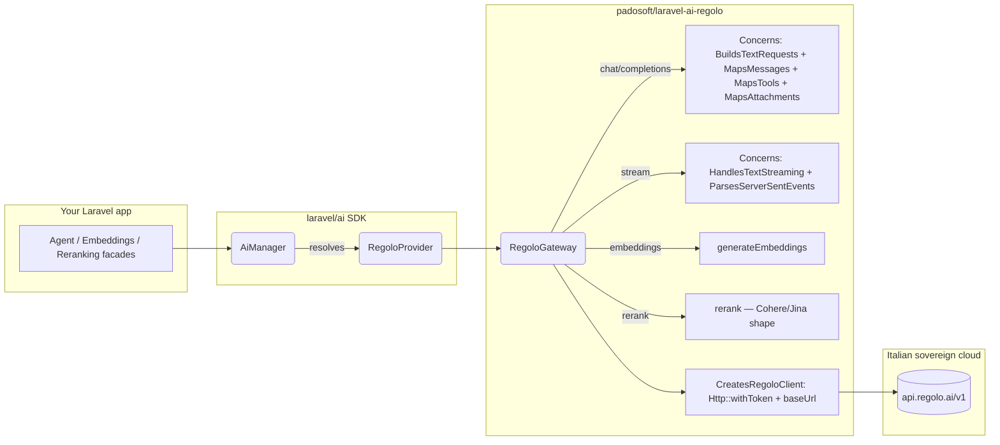

<h1 align="center">laravel-ai-regolo</h1>

<p align="center">
  <strong>The fastest way to ship a Laravel app on Italian sovereign AI infrastructure.</strong><br/>
  A first-class <a href="https://regolo.ai">Seeweb Regolo</a> provider for the official <a href="https://github.com/laravel/ai"><code>laravel/ai</code></a> SDK — chat, embeddings, reranking, image generation, audio transcription, text-to-speech, plus a 30+ open-model catalog hosted entirely in Italy.
</p>

<p align="center">
  <a href="https://github.com/padosoft/laravel-ai-regolo/actions/workflows/ci.yml"></a>
  <a href="https://packagist.org/packages/padosoft/laravel-ai-regolo"></a>
  <a href="https://packagist.org/packages/padosoft/laravel-ai-regolo"></a>
  <a href="LICENSE"></a>
  
  
  <a href="https://github.com/padosoft/laravel-ai-regolo/issues"></a>
</p>

---

## Table of contents

1. [Why this package](#why-this-package)
2. [Design rationale](#design-rationale)
3. [Features at a glance](#features-at-a-glance)
4. [Comparison vs alternatives](#comparison-vs-alternatives)
5. [When to use Regolo vs OpenAI](#when-to-use-regolo-vs-openai)
6. [Installation](#installation)
7. [Quick start](#quick-start)
8. [Usage examples](#usage-examples)
9. [Configuration reference](#configuration-reference)
10. [Architecture](#architecture)
11. [🚀 AI vibe-coding pack included](#ai-vibe-coding-pack-included)
12. [Testing](#testing)
    - [Default suite — offline](#default-suite--offline-zero-cost-runs-everywhere)
    - [Running the live test suite](#running-the-live-test-suite-against-the-real-regolo-api)
13. [Roadmap](#roadmap)
14. [Contributing](#contributing)
15. [Security](#security)
16. [License & credits](#license--credits)

---

## Why this package

`laravel/ai` is the official Laravel AI SDK, and it ships 14+ providers out of the box (OpenAI, Anthropic, Gemini, Mistral, Groq, Cohere, DeepSeek, Bedrock, Azure OpenAI, OpenRouter, Ollama, Jina, VoyageAI, xAI, ElevenLabs).

What it **does not ship** is a provider for [**Regolo**](https://regolo.ai) — Seeweb's Italian sovereign AI cloud. Regolo gives you:

- A growing catalog of **30+ open models** hosted in Italy (Llama 3, Qwen, Mistral, Gemma, Phi, DeepSeek, ...).
- **Chat + embeddings + reranking** under a single API.
- **GDPR + EU AI Act-friendly** hosting — your traffic and your customers' data never leave the EU.
- **Pay-as-you-go pricing** competitive with US-hosted providers, billed in EUR.
- A REST surface that is **OpenAI-compatible** for chat and embeddings (and Cohere/Jina-shaped for reranking), so the same prompts and tooling that work against OpenAI work against Regolo with one config change.

This package fills the gap. Drop it in alongside `laravel/ai`, set a single env var, and Regolo becomes available through the same unified `Agent::for()` / `Embeddings::for()` / `Reranking::of()` APIs the SDK already exposes — no adapter, no wrapper, no learning curve.

> **Italian sovereign cloud, official Laravel API, zero leakage of provider concepts into your domain code.**

## Design rationale

A few decisions are worth surfacing up front, because they shape the package's footprint and the kind of bugs you can or cannot have.

### 1. Provider extension, not SDK fork

`laravel/ai` is a young but well-architected SDK. Forking it to add Regolo would split the ecosystem and force consumers to choose. Instead, this package implements the **public capability contracts** (`TextProvider`, `EmbeddingProvider`, `RerankingProvider`) and the **public gateway contracts** (`TextGateway`, `EmbeddingGateway`, `RerankingGateway`). A single `Padosoft\LaravelAiRegolo\LaravelAiRegoloServiceProvider` registers the binding `ai.provider.regolo`, and the SDK takes it from there.

The blast radius is small: when `laravel/ai` ships a new minor version, you get the upgrade for free; only a contract change in those interfaces would force a release here.

### 2. OpenAI-classic, not OpenAI-Responses

The upstream `OpenAiGateway` targets OpenAI's newer Responses API (`POST /v1/responses`). Regolo is OpenAI-compatible on the **classic** Chat Completions surface (`POST /v1/chat/completions`). The closest upstream template is therefore `MistralGateway` — we mirror its concern split (`BuildsTextRequests` / `MapsMessages` / `MapsTools` / `MapsAttachments` / `HandlesTextStreaming` / `ParsesTextResponses`) and adapt only the namespace and the provider name in the validation exception. See [`docs/laravel-ai-integration-notes.md`](docs/laravel-ai-integration-notes.md) for the full audit.

### 3. Stateless gateway, configuration on the provider

`RegoloGateway::__construct(Dispatcher $events)` takes only the event dispatcher. Credentials and base URL are read from the `Provider` argument on each call via `providerCredentials()['key']` and `additionalConfiguration()['url']`. Two consequences:

- The same gateway instance is safe to share across configurations or to bind as a singleton.
- Rotating an API key or pointing at a staging endpoint is a `config()` change, not a service-provider rebuild.

### 4. Standalone, agnostic

The package has zero dependencies on AskMyDocs, Padosoft proprietary code, or any sister package. It works in any Laravel 12 or 13 application that has `laravel/ai` installed (Laravel 11 is unsupported because the upstream `laravel/ai` SDK itself requires `illuminate/support: ^12.0|^13.0` — see the [Features at a glance](#features-at-a-glance) note). The reverse is true too: `lopadova/askmydocs` and `padosoft/askmydocs-pro` consume this package, never the inverse.

## Features at a glance

- **Chat completion + streaming** via `Agent::for(...)->using('regolo', $model)->prompt()` and `->stream()`.
- **Embeddings** via `Embeddings::for($inputs)->generate('regolo', $model)`.
- **Reranking** via `Reranking::of($docs)->limit($k)->rerank($query, 'regolo', $model)`.
- **Image generation** via `Image::of($prompt)->generate('regolo', $model)` — default model `Qwen-Image`, OpenAI-compatible request shape.
- **Audio transcription (STT)** via `Transcription::of($audio)->using('regolo', $model)->generate()` — default model `faster-whisper-large-v3`, supports per-segment diarization.
- **Audio generation (TTS)** via `Audio::for($text)->generate('regolo', $model)` — wired against `POST /v1/audio/speech`; the upstream catalogue is not fully public yet, so the model id must be supplied explicitly.
- **Open-model catalog** with Italian sovereign hosting (Llama-3.x, Qwen-3, Mistral, Gemma, Phi, DeepSeek, Qwen-Image, faster-whisper, more).
- **Tool calling** — native function calling on models that support it; ReAct-style fallback on those that don't.
- **Strict typing** — PHP 8.3+, readonly DTOs, fully-typed signatures, Pint-formatted, PHPStan level 6.
- **CI matrix** — every push runs against PHP 8.3 / 8.4 / 8.5 × Laravel 12 / 13 (6 jobs). Laravel 11 is **not supported** — `laravel/ai` itself requires `illuminate/support: ^12.0|^13.0`.
- **82 unit tests / 184 assertions** — every Python-SDK happy-path is ported, plus 60+ robustness scenarios (4xx / 429 / 503 / connection-failure / malformed-JSON / Unicode / very-long-prompts / batch boundaries / score-ordering / multi-turn / timeout-fallback misconfiguration / image-edit rejection / multipart-language omission / diarization toggling).
- 🚀 **AI vibe-coding pack ships in the box** — every release includes the [Padosoft Claude pack](#ai-vibe-coding-pack-included) under `.claude/` (skills, rules, agents, slash-commands). The moment you `composer require` this package and open the project in Claude Code, the agent picks up Padosoft's house conventions automatically. **No other Laravel AI provider package ships this today.**
- 🧪 **Opt-in live test suite** — point `REGOLO_API_KEY` at a real key and run `vendor/bin/phpunit --testsuite Live` to verify wire compatibility against `api.regolo.ai`. Default suite remains 100% offline. See [Running the live test suite](#running-the-live-test-suite-against-the-real-regolo-api).

## Comparison vs alternatives

If you are evaluating how to call Regolo from a Laravel app, here are the realistic options on the table today.

| Capability                                  | Custom `Http::` client | `prism-php/prism` | OpenAI-PHP repurposed | **`laravel/ai` + this package** |
|---------------------------------------------|:----------------------:|:-----------------:|:---------------------:|:-------------------------------:|
| Chat completion                             |           ✅           |        ✅         |          ✅           |               ✅                |
| **Streaming** (SSE)                         |           ⚠️ DIY        |        ✅         |          ⚠️ partial    |               ✅                |
| **Embeddings**                              |           ⚠️ DIY        |        ❌         |          ✅           |               ✅                |
| **Reranking**                               |           ⚠️ DIY        |        ❌         |          ❌           |               ✅                |
| **Tool calling**                            |           ⚠️ DIY        |        ✅         |          ✅           |               ✅                |
| Multi-step tool loops                       |           ❌           |        ✅         |          ⚠️ DIY        |               ✅                |
| **Italian sovereign hosting**               |           ✅           |        ❌         |          ❌           |               ✅                |
| Same API as 14+ other providers             |           ❌           |        ✅         |          ❌           |               ✅                |
| First-class Laravel facade & queue support  |           ❌           |        ✅         |          ⚠️ partial    |               ✅                |
| Vercel AI SDK UI compatibility (streaming)  |           ❌           |        ❌         |          ❌           |               ✅                |
| 82 tests / 6-cell CI matrix                 |           ❌           |       N/A         |          ❌           |               ✅                |
| Maintenance burden when SDK ships features  |           you          |       N/A         |          you          |        you get them free        |

**Bottom line:** if you want Regolo behind the same API surface that powers OpenAI, Anthropic, Gemini, Mistral, and Ollama in `laravel/ai`, this is the only package that does it.

## When to use Regolo vs OpenAI

`laravel/ai` ships an OpenAI provider out of the box, so the natural follow-up question is "why would I send traffic to Regolo instead of OpenAI?" Both are valid choices for Laravel apps; they optimise for different things.

### Pick **Regolo** when at least one of these is true

- **GDPR / EU AI Act exposure.** The traffic and the prompts (which often contain user PII, contracts, internal docs, customer support transcripts) never leave the EU — Seeweb's data centres are in Italy, and the privacy policy is bound by Italian law. OpenAI's data-residency story is gradually improving but the default request path still terminates in the US, and the legal review for a regulated workload (banking, healthcare, public-sector, insurance, legal) is materially heavier.
- **Italian-speaking workloads.** Llama-3.x, Qwen3, Mistral and Gemma in Regolo's catalogue are tuned and benchmarked on Italian content; results on idiomatic Italian, technical Italian, and bilingual IT/EN prompts compete with much larger US-hosted closed models.
- **Open-weight models.** Regolo serves open-weight families (Llama, Qwen, Mistral, Gemma, Phi, DeepSeek, Qwen-Image, faster-whisper, ...). If you need to migrate the workload to a self-hosted vLLM / Ollama deployment later, the prompts and the model id port over with zero rewrites — same model, same tokenizer, just a different base URL. Lock-in on closed weights (`gpt-4o`, `claude-sonnet`) makes that migration fundamentally impossible.
- **EUR-billed pay-as-you-go.** Invoices in EUR, Italian VAT applied correctly, no FX-on-USD overhead. Material for finance teams in regulated procurement.
- **Sovereign-cloud procurement requirements.** Public-sector tenders, defence-adjacent workloads, healthcare buyers, and several large Italian enterprises now require an EU-resident inference path as a hard procurement filter. Regolo satisfies it; OpenAI typically does not without the dedicated Microsoft Azure OpenAI EU residency tier.

### Pick **OpenAI** (or stay on it) when

- **Frontier model quality is the deciding factor.** GPT-4o / o1 / GPT-5 still lead on the hardest reasoning, math, and tool-use benchmarks. If your product depends on the absolute top of the curve, OpenAI is hard to beat today.
- **You need Responses API features that have no Regolo counterpart yet.** Hosted Web Search, Code Interpreter as a built-in tool, the new `responses.create` streaming envelope. Regolo's roadmap (see [Roadmap](#roadmap)) tracks these but the upstream catalogue is what determines availability.
- **Heavy ecosystem reliance on OpenAI-specific APIs.** Function calling extensions (parallel tool calls with pinned schemas), structured outputs at scale, the Files / Assistants / Vector Stores managed services. Some of these have analogues on the Regolo side (`/v1/embeddings`, `/v1/rerank`); others do not.
- **No EU-residency requirement and no model-portability concern.** If your workload is happy on US-hosted closed weights and you're not preparing for a self-host migration, the procurement-and-compliance argument for moving away from OpenAI shrinks meaningfully.

### Mix-and-match is fine and expected

Because both providers register through `laravel/ai`'s identical SDK surface, you can route per-feature in a single Laravel app:

```php
// config/ai.php — both providers wired side-by-side
'providers' => [
    'openai' => [/* … OpenAI key, models … */],
    'regolo' => [/* … Regolo key, models … */],
],

// Anti-hallucination KB chat → Regolo (EU residency for the user prompts).
$answer = Agent::for($question)->using('regolo', 'Llama-3.3-70B-Instruct')->prompt();

// Frontier reasoning over a synthetic dataset (no PII) → OpenAI.
$reasoning = Agent::for($problem)->using('openai', 'gpt-4o')->prompt();
```

This is also why the [Comparison table above](#comparison-vs-alternatives) emphasises "same API as 14+ other providers" — the value of `laravel/ai` is precisely that you can rebalance traffic across providers without touching application code.

## Installation

```bash
composer require laravel/ai
composer require padosoft/laravel-ai-regolo
```

The package auto-registers via Laravel's package discovery — no manual provider entry in `config/app.php` needed.

Add the `regolo` entry to your `config/ai.php` (publish it from `laravel/ai` if you haven't yet):

```php
return [

    'providers' => [
        // Built-in providers from laravel/ai (OpenAI / Anthropic / Gemini /
        // Mistral / Groq / Cohere / DeepSeek / Bedrock / Azure OpenAI /
        // OpenRouter / Ollama / Jina / VoyageAI / xAI / ElevenLabs)
        'openai' => ['driver' => 'openai', 'key' => env('OPENAI_API_KEY')],
        'ollama' => ['driver' => 'ollama'],

        // Added by this package
        'regolo' => [
            'driver'  => 'regolo',
            'name'    => 'regolo',
            'key'     => env('REGOLO_API_KEY'),
            'url'     => env('REGOLO_BASE_URL', 'https://api.regolo.ai/v1'),
            'timeout' => 60,
            'models'  => [
                'text'       => [
                    'default'  => 'Llama-3.1-8B-Instruct',
                    'cheapest' => 'Llama-3.1-8B-Instruct',
                    'smartest' => 'Llama-3.3-70B-Instruct',
                ],
                'embeddings' => [
                    'default'    => 'Qwen3-Embedding-8B',
                    'dimensions' => 4096,
                ],
                'reranking'  => [
                    'default' => 'jina-reranker-v2',
                ],
            ],
        ],
    ],

    'defaults' => [
        'text'        => env('AI_DEFAULT_TEXT', 'regolo'),
        'embeddings'  => env('AI_DEFAULT_EMBEDDINGS', 'regolo'),
        'reranking'   => env('AI_DEFAULT_RERANKING', 'regolo'),
    ],

];
```

In your `.env`:

```dotenv
REGOLO_API_KEY=rg_live_...
REGOLO_BASE_URL=https://api.regolo.ai/v1   # optional
AI_DEFAULT_TEXT=regolo                      # or any other configured provider
```

## Quick start

```php
use Laravel\Ai\Agent;

$response = Agent::for('Tell me three things about Rome.')
    ->using('regolo', 'Llama-3.3-70B-Instruct')
    ->prompt();

echo $response->text;
//  Rome was founded in 753 BC. It hosts the Vatican City...
```

That's it. Five lines.

## Usage examples

### Chat completion

```php
use Laravel\Ai\Agent;

$response = Agent::for('Riassumi il manzoniano "Addio monti" in tre righe.')
    ->using('regolo', 'Llama-3.3-70B-Instruct')
    ->prompt();

$response->text;             // string — final assistant message
$response->usage->promptTokens;
$response->usage->completionTokens;
$response->meta->provider;   // 'regolo'
$response->meta->model;      // 'Llama-3.3-70B-Instruct'
```

### Streaming (token-by-token)

```php
use Laravel\Ai\Agent;
use Laravel\Ai\Streaming\Events\TextDelta;

foreach (Agent::for('Spiega il teorema di Pitagora.')->using('regolo')->stream() as $event) {
    if ($event instanceof TextDelta) {
        echo $event->delta;
    }
}
```

### Streaming with a Vercel AI SDK UI frontend

```php
return Agent::for($prompt)
    ->using('regolo')
    ->stream()
    ->usingVercelDataProtocol();
```

The response is a Vercel-compatible byte stream you can consume directly from `@ai-sdk/react`'s `useChat()` hook on the frontend.

### Tool calling

```php
use Laravel\Ai\Agent;
use Laravel\Ai\Contracts\Tool;
use Illuminate\JsonSchema\JsonSchema;

class GetWeather implements Tool
{
    public function description(): string { return 'Lookup current weather for an Italian city.'; }

    public function schema(JsonSchema $schema): array
    {
        return $schema->object()
            ->property('city', $schema->string()->required())
            ->toArray();
    }

    public function handle(\Laravel\Ai\Tools\Request $request): string
    {
        $city = $request->arguments['city'];
        return "The weather in {$city} is sunny, 24°C.";
    }
}

$response = Agent::for('Che tempo fa a Roma oggi?')
    ->using('regolo', 'Llama-3.3-70B-Instruct')
    ->withTool(new GetWeather)
    ->prompt();

$response->text;            // includes the tool's output, woven into the answer
$response->toolCalls;       // Collection<ToolCall>
$response->toolResults;     // Collection<ToolResult>
```

### Embeddings (single + batch)

```php
use Laravel\Ai\Embeddings;

// Single input
$single = Embeddings::for(['Roma è la capitale d\'Italia.'])
    ->generate('regolo', 'Qwen3-Embedding-8B');

$single->first();       // float[]  — 4096-dim vector
$single->tokens;        // int      — billed token count

// Batch (one HTTP call, one billed request)
$batch = Embeddings::for([
    'Roma è la capitale d\'Italia.',
    'Parigi è la capitale della Francia.',
    'Madrid è la capitale della Spagna.',
])->generate('regolo');

count($batch->embeddings);   // 3
$batch->meta->model;         // 'Qwen3-Embedding-8B' (default from config)
```

### Reranking (Cohere/Jina-shaped)

```php
use Laravel\Ai\Reranking;

$ranked = Reranking::of([
    'Rome is the capital of Italy.',
    'Paris is the capital of France.',
    'Pasta al pomodoro is a classic Italian dish.',
])
    ->limit(2)
    ->rerank('What is the capital of Italy?', 'regolo', 'jina-reranker-v2');

foreach ($ranked->results as $result) {
    echo "{$result->score}  {$result->document}\n";
}
//  0.91  Rome is the capital of Italy.
//  0.05  Pasta al pomodoro is a classic Italian dish.
```

The original `index` and `document` are preserved on each result so you can map back to your source data without a second lookup.

## Configuration reference

| Key                                                | Type    | Default                       | Notes                                                                 |
|----------------------------------------------------|---------|-------------------------------|-----------------------------------------------------------------------|
| `ai.providers.regolo.driver`                       | string  | `regolo`                      | Required. Resolves the binding `ai.provider.regolo`.                  |
| `ai.providers.regolo.name`                         | string  | `regolo`                      | Echoed in `Meta::$provider`.                                          |
| `ai.providers.regolo.key`                          | string  | `env('REGOLO_API_KEY')`       | **Required.** Bearer token sent on every request.                     |
| `ai.providers.regolo.url`                          | string  | `https://api.regolo.ai/v1`    | Override for staging or self-hosted Regolo instances.                 |
| `ai.providers.regolo.timeout`                      | int     | `60`                          | Per-call timeout in seconds. Override at call-time via `$timeout`.    |
| `ai.providers.regolo.models.text.default`          | string  | `Llama-3.1-8B-Instruct`       | Model used when `Agent::using('regolo')` is called without a model.   |
| `ai.providers.regolo.models.text.cheapest`         | string  | `Llama-3.1-8B-Instruct`       | Used by `Lab::Cheapest` shorthand.                                    |
| `ai.providers.regolo.models.text.smartest`         | string  | `Llama-3.3-70B-Instruct`      | Used by `Lab::Smartest` shorthand.                                    |
| `ai.providers.regolo.models.embeddings.default`    | string  | `Qwen3-Embedding-8B`          | Used by `Embeddings::for()->generate('regolo')`.                      |
| `ai.providers.regolo.models.embeddings.dimensions` | int     | `4096`                        | Embedding vector dimension. Must match downstream vector store.       |
| `ai.providers.regolo.models.reranking.default`     | string  | `jina-reranker-v2`            | Used by `Reranking::of()->rerank(..., 'regolo')`.                     |
| `ai.providers.regolo.models.image.default`         | string  | `Qwen-Image`                  | Used by `Image::of(...)->generate('regolo')`. Wire to `env('REGOLO_IMAGE_MODEL', 'Qwen-Image')` in `config/ai.php` for env-var override. |
| `ai.providers.regolo.models.transcription.default` | string  | `faster-whisper-large-v3`     | Used by `Transcription::of($audio)->using('regolo')->generate()`. Wire to `env('REGOLO_TRANSCRIPTION_MODEL', 'faster-whisper-large-v3')`. |
| `ai.providers.regolo.models.audio.default`         | string  | _empty_                       | Used by `Audio::for(...)->generate('regolo')` (TTS). Regolo's TTS catalogue is not on `GET /v1/models` yet; pass the model id explicitly. Wire to `env('REGOLO_AUDIO_MODEL')`. |

## Architecture



The package contributes only the orange box. Everything else is upstream `laravel/ai`. A change to your prompt does not need a single line of provider code touched.

## 🚀 AI vibe-coding pack included

> **No other Laravel AI provider package on Packagist ships this today.**

Every release of this package includes the [Padosoft Claude pack](.claude/) under the `.claude/` directory: the same skills, rules, agents, and slash-commands the Padosoft team uses internally to keep AI-driven development consistent across all our repos. The moment you `composer require padosoft/laravel-ai-regolo` and open the project in [Claude Code](https://claude.com/claude-code), the agent automatically picks up the pack and applies it.

### What ships in the pack

```
.claude/
├── skills/
│   └── copilot-pr-review-loop/   ← R36: 9-step PR flow (--reviewer copilot,
│                                    wait CI green, wait Copilot review, fix,
│                                    re-CI, merge only when both gates green)
└── (more skills, rules, agents, slash-commands as the pack grows;
    see padosoft/* sister packages for the full set)
```

### Why this matters

When a contributor (you, a team-mate, the Seeweb engineer doing wire-compatibility verification, or a random open-source PR author) opens this repo in Claude Code:

1. The agent reads the pack on session start.
2. The R36 PR-review skill kicks in automatically the first time the contributor types `gh pr create`. The agent uses `--reviewer copilot`, waits for CI, waits for Copilot review, addresses comments, re-checks CI, and only merges when both gates are green.
3. Future skills (style enforcement, security review, release-note generator, ...) plug into the same pack with zero configuration on the consumer side.

The result: **you get the Padosoft AI engineering culture in the same `composer require` that gets you the Regolo provider.** Drop-in vibe-coding for any team that wants to ship Italian-sovereign AI without re-inventing the development workflow.

### Opting out

Do not want the pack? Add `.claude/` to your `.gitignore` (or delete it locally). The package code under `src/` works completely independently of the pack — the pack is purely a developer-experience layer for repos that use Claude Code.

### Want to contribute a skill?

The same pack is shared across `padosoft/laravel-ai-regolo`, `padosoft/laravel-flow`, `padosoft/eval-harness`, `padosoft/laravel-pii-redactor`, and the upcoming `padosoft/laravel-patent-box-tracker` — open a PR on any of those repos and we will sync the skill across the family.

## Testing

### Default suite — offline, zero cost, runs everywhere

The package ships **82 unit tests / 184 assertions** that run against a fake HTTP layer (`Http::fake()`), so the test suite never hits the real Regolo API and is safe to run in CI on every PR. No API key needed; no network needed; no money spent.

```bash
composer install
vendor/bin/phpunit
# OK (82 tests, 184 assertions)
```

Coverage breakdown:

| Suite                              | Tests | Description                                                          |
|------------------------------------|:-----:|----------------------------------------------------------------------|
| `RegoloGatewayChatTest`            |   21  | 4 ported from Regolo Python SDK + 17 robustness (streaming, errors)  |
| `RegoloGatewayEmbeddingsTest`      |   12  | 1 ported + 11 robustness (empty / batch / Unicode / 4xx / 429 / 503) |
| `RegoloGatewayRerankTest`          |   13  | 1 ported + 12 robustness (top_n / score-ordering / index integrity)  |
| `RegoloGatewayImageTest`           |    8  | `images/generations` happy + size/quality + edit-rejection + timeout const + provider-config precedence |
| `RegoloGatewayAudioTest`           |    6  | `audio/speech` (TTS) happy + voice/instructions forwarding + empty-body resilience |
| `RegoloGatewayTranscriptionTest`   |    7  | `audio/transcriptions` (STT) happy + diarize + Whisper usage mapping + multipart-filename MIME extension matrix |
| `RegoloGatewayTimeoutFallbackTest` |    8  | provider-level timeout fallback (numeric / empty / non-numeric / negative) |
| `ServiceProviderTest`              |    7  | container binding + capability interfaces + gateway compositional    |

The test inventory and the rationale for each robustness scenario is documented in [`docs/test-coverage-vs-python-sdk.md`](docs/test-coverage-vs-python-sdk.md).

CI matrix: PHP 8.3 / 8.4 / 8.5 × Laravel 12 / 13 (6 cells — Laravel 11 is unsupported because the upstream `laravel/ai` SDK itself requires `illuminate/support: ^12.0|^13.0`), plus a separate static-analysis job that runs PHPStan and Pint.

### Running the live test suite (against the real Regolo API)

If you want to verify behaviour against the real Regolo servers — for example you are a [Seeweb](https://www.seeweb.it/) / Regolo engineer validating the package, an enterprise adopter doing a pre-deploy smoke-test, or an open-source contributor confirming wire compatibility before tagging a release — the package ships a dedicated **`Live`** PHPUnit testsuite that hits `https://api.regolo.ai/v1` end-to-end.

The live suite is **opt-in by design**:

- A fresh `git clone` + `composer install` + `vendor/bin/phpunit` runs only the offline `Unit` suite. No accidental cost.
- The `Live` suite **self-skips** when `REGOLO_API_KEY` is missing, so it cannot accidentally fail a CI job that does not have credentials.
- The CI matrix on this repo runs **only** the offline `Unit` suite. Live tests run only when invoked explicitly with `--testsuite Live`.

#### 1. Get a Regolo API key

[regolo.ai](https://regolo.ai) → sign up → copy your `rg_live_...` key.

#### 2. Configure the environment

The bare minimum is a single env var:

```bash
export REGOLO_API_KEY=rg_live_...
```

Optional overrides (defaults pick the same models the package ships as defaults):

```bash
export REGOLO_BASE_URL=https://api.regolo.ai/v1     # change for staging
export REGOLO_LIVE_TEXT_MODEL=Llama-3.1-8B-Instruct
export REGOLO_LIVE_EMBEDDINGS_MODEL=Qwen3-Embedding-8B
export REGOLO_LIVE_RERANKING_MODEL=jina-reranker-v2
export REGOLO_LIVE_IMAGE_MODEL=Qwen-Image
export REGOLO_LIVE_TRANSCRIPTION_MODEL=faster-whisper-large-v3
export REGOLO_LIVE_TIMEOUT=60                       # seconds

# Multimodal — required for the corresponding live test (the test
# self-skips when the var is unset):
# REGOLO_LIVE_AUDIO_MODEL=...                       # TTS model id from Seeweb (catalogue not on /v1/models yet)
# REGOLO_LIVE_TRANSCRIPTION_AUDIO_PATH=/path/to/sample.mp3  # any short speech recording

# Multimodal — optional overrides (defaults apply when unset):
# REGOLO_LIVE_AUDIO_VOICE=alloy                     # voice id forwarded verbatim to TTS
# REGOLO_LIVE_TRANSCRIPTION_LANGUAGE=it             # ISO 639-1; omit to let Whisper auto-detect
```

On Windows PowerShell:

```powershell
$env:REGOLO_API_KEY = "rg_live_..."
```

#### 3. Run the live suite

```bash
vendor/bin/phpunit --testsuite Live
```

Expected output (with a working key + the default models):

```
PHPUnit by Sebastian Bergmann.

........                                  6 / 6 (100%)

Time: ~10s   Memory: 30 MB

OK (6 tests, ~25 assertions)
```

If the env var is unset:

```
PHPUnit by Sebastian Bergmann.

ssssss                                    6 / 6 (100%)

Time: ~0.3s

OK, but some tests were skipped!
Tests: 6, Assertions: 0, Skipped: 6.
```

#### What the live suite verifies

| File                              | What it asserts on the real API                                                    | Cost          |
|-----------------------------------|------------------------------------------------------------------------------------|---------------|
| `RegoloChatLiveTest`              | `POST /v1/chat/completions` returns non-empty `text` + non-zero token usage        | ~200 tokens   |
| `RegoloStreamingLiveTest`         | `POST /v1/chat/completions` with `stream: true` emits SSE → `TextDelta` events     | ~150 tokens   |
| `RegoloEmbeddingsLiveTest`        | `POST /v1/embeddings` returns non-empty vectors with uniform length across a batch | ~100 tokens   |
| `RegoloRerankLiveTest`            | `POST /v1/rerank` orders documents by relevance, top-1 matches the obvious answer  | minimal       |
| `RegoloImageLiveTest`             | `POST /v1/images/generations` (Qwen-Image) returns valid base64 PNG (file signature checked) | ~€0.001 |
| `RegoloAudioLiveTest`             | `POST /v1/audio/speech` (TTS) returns valid base64 MP3 (ID3 tag or MPEG sync word) — **self-skips** unless `REGOLO_LIVE_AUDIO_MODEL` is set, since Regolo's TTS catalogue is not on `/v1/models` yet | minimal |
| `RegoloTranscriptionLiveTest`     | `POST /v1/audio/transcriptions` (faster-whisper-large-v3) returns non-empty `text` — **self-skips** unless `REGOLO_LIVE_TRANSCRIPTION_AUDIO_PATH` points at a real speech file | minimal |

**Total cost per run**: well under €0.01 with the default small-model selection. Pick a heavier text model via `REGOLO_LIVE_TEXT_MODEL` if you want to validate a specific catalogue entry — the cost scales linearly with the model.

#### CI policy

The live suite is **never** run from this package's `.github/workflows/ci.yml`. The matrix invokes `vendor/bin/phpunit` (default config = `Unit` testsuite). To run the live suite in your own pipeline:

```yaml
- name: Live verification (manual workflow_dispatch only)
  if: env.REGOLO_API_KEY != ''
  env:
    REGOLO_API_KEY: ${{ secrets.REGOLO_API_KEY }}
  run: vendor/bin/phpunit --testsuite Live
```

Open an issue or PR if you want a `workflow_dispatch` job added to this repo to support scheduled live verification.

## Roadmap

| Version | Status   | Highlights                                                                                                  |
|---------|----------|-------------------------------------------------------------------------------------------------------------|
| v0.1    | shipped  | Chat + streaming + embeddings + reranking + 61 tests + 6-cell CI matrix + WOW README + opt-in Live testsuite + AI vibe-coding pack. **First public release.** |
| v0.2    | shipped  | Multimodal: image generation (`Image::of(...)->generate('regolo', ...)` against `/v1/images/generations`, default `Qwen-Image`), audio transcription (`Transcription::of($audio)->using('regolo', ...)->generate()` against `/v1/audio/transcriptions`, default `faster-whisper-large-v3`), text-to-speech (`Audio::for($text)->generate('regolo', ...)` against `/v1/audio/speech`). 82 tests / 184 assertions. |
| v0.3    | planned  | Provider-tools registry (Regolo-hosted web search / code interpreter, when published).                       |
| v0.4    | exploring | Adaptive routing helper — pick `cheapest` vs `smartest` model per prompt with a small classifier.            |
| v1.0    | tracking | Stable contract pinned against `laravel/ai` ^1.0 GA.                                                         |

Open issues and feature votes: [github.com/padosoft/laravel-ai-regolo/issues](https://github.com/padosoft/laravel-ai-regolo/issues).

## Contributing

Contributions are welcome — bug reports, test cases, new robustness scenarios, documentation polish.

1. Fork the repository.
2. Create a feature branch (`feature/your-thing`) targeting `main`.
3. Run `vendor/bin/phpunit` and `vendor/bin/pint --test` locally.
4. Open a PR with a clear description and a test that covers the change.

We follow the project conventions documented in [`CONTRIBUTING.md`](CONTRIBUTING.md). Please respect the existing concern split (`src/Gateway/Regolo/Concerns/`) when adding capabilities — it keeps the package legible, easy to test, and easy to align with future upstream `laravel/ai` releases.

## Security

Found a security issue? Please **do not open a public issue**. Email `security@padosoft.com` instead. We follow standard responsible-disclosure timelines documented in [`SECURITY.md`](SECURITY.md).

## License & credits

Apache-2.0 — see [`LICENSE`](LICENSE).

Built and maintained by [Padosoft](https://padosoft.com). Initially developed alongside [AskMyDocs](https://github.com/lopadova/AskMyDocs), but the package is fully **standalone agnostic** — no AskMyDocs dependency, no Padosoft proprietary glue.

Sister packages in the Padosoft AI stack:

- [`padosoft/laravel-flow`](https://github.com/padosoft/laravel-flow) — saga / workflow orchestration for Laravel.
- [`padosoft/eval-harness`](https://github.com/padosoft/eval-harness) — RAG + agent evaluation harness.
- [`padosoft/laravel-pii-redactor`](https://github.com/padosoft/laravel-pii-redactor) — PII redaction middleware for AI prompts.
- [`padosoft/laravel-patent-box-tracker`](https://github.com/padosoft/laravel-patent-box-tracker) — Italian Patent Box R&D auto-tracker.

Each is independently usable. None requires the others. Pick what you need.

---

<p align="center">
  <sub>Made with ☕ in Italy by <a href="https://padosoft.com">Padosoft</a>.</sub>
</p>
