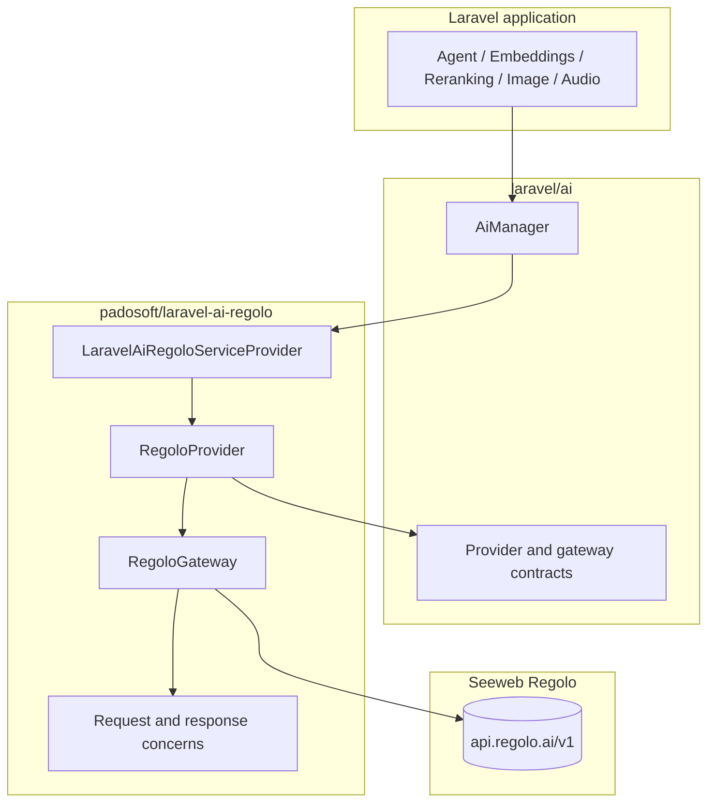

# Design

The package uses provider extension, not SDK fork. All application-facing APIs stay in `laravel/ai`; this package only contributes the Regolo provider and gateway implementation.

## Key design points

- `RegoloGateway` receives the event dispatcher through the constructor.
- Credentials and base URL are read from the provider argument per call.
- Chat targets classic OpenAI-compatible chat completions.
- Reranking follows the Cohere/Jina-shaped request model.
- Concerns keep request construction and response parsing testable.

:::warning
Do not move provider configuration into gateway constructor state. Per-call provider configuration is what keeps shared gateway instances safe across config changes.
:::
