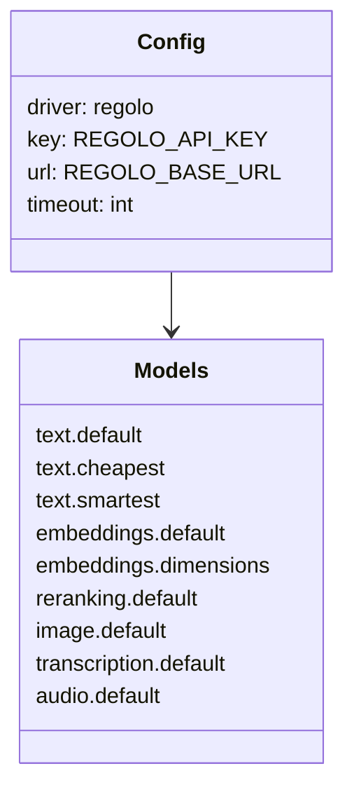

# Modello Dati E Contratto

The important contract is not Regolo's raw JSON. The stable application contract is Laravel AI's request and response DTO layer.

## Configuration contract



## Response contract

| Laravel AI field | Meaning | Stability guidance |
| --- | --- | --- |
| `text` | Final assistant text | Safe for app code. |
| `usage` | Token usage when provider returns it | Optional in defensive code. |
| `meta.provider` | `regolo` | Safe for logging. |
| `meta.model` | Model id used | Safe for analytics. |
| `results[index]` | Original rerank candidate index | Required for source mapping. |

## Persistence contract

Store model metadata beside generated artifacts:

```php
[
    'provider' => 'regolo',
    'model' => 'Qwen3-Embedding-8B',
    'dimensions' => 4096,
    'embedded_at' => now(),
]
```

This lets you detect stale embeddings and plan rebuilds.
