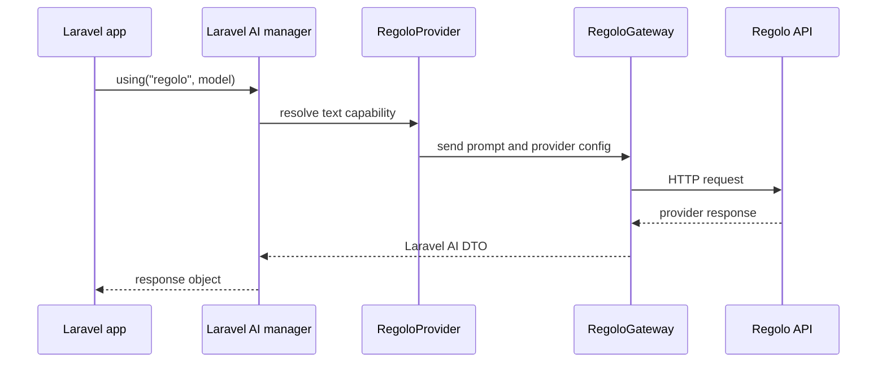

# Teoria

The package is a provider extension. It does not replace Laravel AI; it implements the contracts Laravel AI already expects.

## Provider routing

Laravel AI resolves a provider by driver name, then asks that provider for capabilities. Regolo is registered as `ai.provider.regolo`.

## Similarity and reranking

Embeddings produce vectors. A common similarity score is cosine similarity:

$$
\cos(\theta) = \frac{A \cdot B}{\|A\|\|B\|}
$$

Reranking is different. It reads the query and candidate text together, then orders candidates by relevance. Use embeddings to retrieve broadly and reranking to choose precisely.

## Streaming

Streaming is an event translation problem. The gateway reads server-sent deltas and emits Laravel AI streaming events so UI and queue code can stay provider-neutral.
