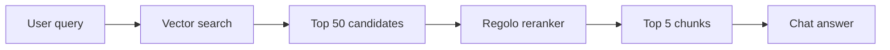

# Reranking

Reranking scores candidate documents against a query after an initial retrieval pass. The provider maps Laravel AI reranking calls to Regolo's Cohere/Jina-shaped endpoint.

```php
use Laravel\Ai\Reranking;

$ranked = Reranking::of($candidateTexts)
    ->limit(5)
    ->rerank($query, 'regolo', 'Qwen3-Reranker-4B');
```

## Retrieval pipeline



## Preserve indexes

Each reranked result preserves the original candidate index and document. That lets you map results back to database rows, access controls, and source metadata without fuzzy matching text.

:::tip
Apply tenant, permission, and freshness filters before reranking. Reranking should choose the best allowed context, not decide what the user is allowed to see.
:::
