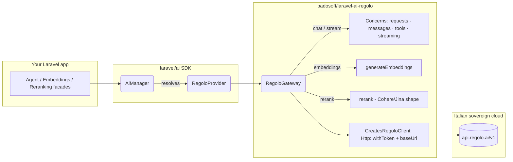

# laravel-ai-regolo


> **laravel-ai-regolo makes Seeweb's Italian sovereign AI cloud a drop-in provider for the official `laravel/ai` SDK.**
> Keep writing `Agent::for()`, `Embeddings::for()`, `Reranking::of()` — and route chat, streaming,
> embeddings, reranking, image generation, transcription and text-to-speech to **30+ open models hosted
> entirely in Italy**. EU-resident by default, GDPR and EU AI-Act friendly, billed in EUR, with **zero
> provider concepts leaking into your domain code**.

::: callout info "New here? Read this page top to bottom" icon:compass
In five minutes you'll know exactly what this package is, the problem it solves, why it beats every other
way of calling Regolo from Laravel, and where to click next. Every other page goes deeper — this one gives
you the whole picture.
:::

---

## What it is — in one minute

`laravel/ai` is the official Laravel AI SDK and ships 14+ providers (OpenAI, Anthropic, Gemini, Mistral,
Groq, Cohere, DeepSeek, Bedrock, Azure OpenAI, OpenRouter, Ollama, Jina, VoyageAI, xAI, ElevenLabs). What
it **does not ship** is a provider for [**Regolo**](https://regolo.ai) — Seeweb's Italian sovereign AI cloud.

`laravel-ai-regolo` fills that gap. Drop it in alongside `laravel/ai`, set a single env var, and Regolo
becomes available through the exact same unified SDK facades you already use:

- **One config change, no new API** — `Agent::for()->using('regolo', $model)` works the moment the package
  is installed. No adapter, no wrapper, no learning curve.
- **Everything Regolo can do** — chat, token-by-token streaming, embeddings, reranking, image generation,
  audio transcription (STT) and text-to-speech (TTS), all behind the standard SDK contracts.
- **Italian sovereign hosting** — your prompts, documents, transcripts and customer data never leave the
  EU; Seeweb's data centres are in Italy and billing is in EUR.

> **In one line:** *the EU-sovereign provider `laravel/ai` is missing — call 30+ open models hosted in
> Italy through the same Laravel AI facades that power OpenAI, Anthropic and Gemini.*

---

## The problem it solves

If you ship AI on Laravel and have any EU-residency, data-sovereignty or open-weight concern, you hit the
same wall. Here is the gap this package closes.

| Without laravel-ai-regolo | With laravel-ai-regolo |
|---|---|
| `laravel/ai` ships no Regolo provider — there is no supported path to Seeweb's sovereign cloud. | A first-class `regolo` driver registered through the SDK's public provider contracts. |
| Calling Regolo means a hand-rolled `Http::` client — you re-implement streaming, embeddings, reranking and error handling yourself. | Chat, streaming, embeddings, reranking, image, STT and TTS all behind the standard SDK facades. |
| Prompts (often full of user PII, contracts, transcripts) terminate in the US by default — heavy legal review for regulated workloads. | Traffic stays EU-resident in Italy; GDPR + EU AI-Act friendly, bound by Italian law. |
| Locked into closed weights (`gpt-4o`, `claude-sonnet`) — a self-host migration is fundamentally impossible. | Open-weight families (Llama, Qwen, Mistral, Gemma, Phi, DeepSeek) — port the same model id to vLLM/Ollama later with zero rewrites. |
| A bespoke client drifts every time `laravel/ai` ships a feature — you maintain it forever. | New SDK minors land for free; only an interface change in the public contracts forces a release here. |
| Switching some traffic to a sovereign provider means rewriting application code. | Rebalance per-feature across providers with a single `->using('regolo', …)` — no domain code touched. |

---

## Who it's for

::: grids
  ::: grid
    ::: card "Teams on laravel/ai today" icon:rocket
    Already using the official SDK? Add one provider block and one env var — Regolo is available through the same `Agent` / `Embeddings` / `Reranking` facades, no new API to learn.
    :::
  :::
  ::: grid
    ::: card "Regulated & public-sector buyers" icon:landmark
    Banking, healthcare, insurance, legal and public tenders that require an EU-resident inference path as a hard procurement filter — Regolo satisfies it; default US-hosted providers typically do not.
    :::
  :::
  ::: grid
    ::: card "Italian-language workloads" icon:languages
    Llama-3.x, Qwen3, Mistral and Gemma in Regolo's catalogue are tuned and benchmarked on Italian — idiomatic, technical and bilingual IT/EN prompts compete with much larger closed models.
    :::
  :::
  ::: grid
    ::: card "Open-weight & portability-minded teams" icon:package-open
    Want the option to migrate to self-hosted vLLM/Ollama later? Open-weight models, same tokenizer, same model id — just a different base URL.
    :::
  :::
:::

---

## Why it's different — the moats

Most ways of reaching Regolo either fork the SDK or hand-roll a client. This package does neither — it
extends the official SDK through its public contracts and ships everything Regolo can do.

::: grids
  ::: grid
    ::: card "Provider extension, not SDK fork" icon:git-branch
    Implements the public capability + gateway contracts (`TextProvider`, `EmbeddingProvider`, `RerankingProvider`, …) and registers `ai.provider.regolo`. Tiny blast radius — new `laravel/ai` minors upgrade for free.
    :::
  :::
  ::: grid
    ::: card "EU data sovereignty by default" icon:shield-check
    Prompts and customer data never leave the EU. Seeweb's data centres are in Italy, the privacy policy is bound by Italian law — GDPR and EU AI-Act friendly out of the box.
    :::
  :::
  ::: grid
    ::: card "Full multimodal surface" icon:layers
    Chat, streaming, embeddings, reranking, image generation, audio transcription and text-to-speech — every capability behind the standard SDK facade, not just chat.
    :::
  :::
  ::: grid
    ::: card "30+ open-model catalog" icon:boxes
    Llama-3.x, Qwen3, Mistral, Gemma, Phi, DeepSeek, Qwen-Image, faster-whisper and more — open weights you can port to a self-hosted deployment with zero prompt rewrites.
    :::
  :::
  ::: grid
    ::: card "Stateless gateway, config on the provider" icon:settings
    Credentials and base URL are read from the `Provider` on each call — the gateway is singleton-safe, and rotating a key or pointing at staging is a `config()` change, not a rebuild.
    :::
  :::
  ::: grid
    ::: card "OpenAI-classic compatibility" icon:plug
    Wired to the classic Chat Completions surface (`/v1/chat/completions`), so the same prompts and tooling that work against OpenAI work against Regolo with one config change.
    :::
  :::
  ::: grid
    ::: card "Vercel AI SDK UI streaming" icon:radio
    `->stream()->usingVercelDataProtocol()` returns a Vercel-compatible byte stream you can consume straight from `@ai-sdk/react`'s `useChat()` — token-by-token, no glue code.
    :::
  :::
  ::: grid
    ::: card "82 tests, 6-cell CI matrix" icon:flask-conical
    82 unit tests / 184 assertions over a faked HTTP layer (errors, Unicode, batch boundaries, score-ordering, timeouts), plus an opt-in `Live` suite hitting the real `api.regolo.ai`. CI runs PHP 8.3/8.4/8.5 × Laravel 12/13.
    :::
  :::
  ::: grid
    ::: card "AI vibe-coding pack in the box" icon:sparkles
    Every release ships the Padosoft Claude pack under `.claude/` — skills, rules, agents and slash-commands. Open the repo in Claude Code and the agent already knows the house conventions. No other Laravel AI provider package ships this today.
    :::
  :::
:::

---

## See it in action — laravel-ai-chat demo

Want to see this package powering a real ChatGPT-style chatbot?
[`padosoft/laravel-ai-chat`](https://github.com/padosoft/laravel-ai-chat) is a runnable, MIT-licensed demo
on Laravel 13 + React that drops this provider behind the [Vercel AI SDK UI](https://ai-sdk.dev) — five
prompts trigger five tools that render inline as image / document / link-list / code / data-table
artifacts, token-by-token streaming end-to-end with no glue code on top of `laravel/ai` and this package.


**[▶ Open the demo on GitHub →](https://github.com/padosoft/laravel-ai-chat)**

---

## laravel-ai-regolo vs. the alternatives

How do you realistically call Regolo from a Laravel app today?

| Capability | **laravel/ai + this package** | Custom `Http::` client | `prism-php/prism` | OpenAI-PHP repurposed |
|---|:---:|:---:|:---:|:---:|
| Chat completion | ✅ | ✅ | ✅ | ✅ |
| Streaming (SSE) | ✅ | ➖ | ✅ | ➖ |
| Embeddings | ✅ | ➖ | ❌ | ✅ |
| Reranking | ✅ | ➖ | ❌ | ❌ |
| Tool calling + multi-step loops | ✅ | ❌ | ✅ | ➖ |
| Italian sovereign hosting | ✅ | ✅ | ❌ | ❌ |
| Same API as 14+ other providers | ✅ | ❌ | ✅ | ❌ |
| Vercel AI SDK UI streaming | ✅ | ❌ | ❌ | ❌ |
| You get new SDK features for free | ✅ | ❌ | N/A | ❌ |

> Legend: ✅ built-in · ➖ partial / DIY · ❌ not available.

**Bottom line:** if you want Regolo behind the same API surface that powers OpenAI, Anthropic, Gemini,
Mistral and Ollama in `laravel/ai`, this is the only package that does it.

---

## How it fits together

The package contributes only the provider + gateway box. Everything else is upstream `laravel/ai`. A
change to your prompt does not need a single line of provider code touched.



---

## Start in 30 seconds

::: steps
1. **Install the package**
   ```bash
   composer require laravel/ai
   composer require padosoft/laravel-ai-regolo
   ```
   Auto-registers via package discovery — no manual provider entry in `config/app.php`.

2. **Add the `regolo` provider to `config/ai.php`**
   ```php
   'providers' => [
       'regolo' => [
           'driver' => 'regolo',
           'name'   => 'regolo',
           'key'    => env('REGOLO_API_KEY'),
           'url'    => env('REGOLO_BASE_URL', 'https://api.regolo.ai/v1'),
           'models' => [
               'text'       => ['default' => 'Llama-3.1-8B-Instruct', 'smartest' => 'Llama-3.3-70B-Instruct'],
               'embeddings' => ['default' => 'Qwen3-Embedding-8B', 'dimensions' => 4096],
               'reranking'  => ['default' => 'Qwen3-Reranker-4B'],
           ],
       ],
   ],
   ```
   ```dotenv
   REGOLO_API_KEY=rg_live_...
   ```

3. **Prompt Regolo — five lines**
   ```php
   use Laravel\Ai\Agent;

   $response = Agent::for('Tell me three things about Rome.')
       ->using('regolo', 'Llama-3.3-70B-Instruct')
       ->prompt();

   echo $response->text; // Rome was founded in 753 BC. It hosts the Vatican City...
   ```
:::

**[→ Installation](/get-started/installation)** · **[→ Quick Start](/get-started/quick-start)** · **[→ Worked Example](/guides/worked-example)**

---

## Batteries included for AI-assisted development

Every release ships the [Padosoft Claude pack](https://github.com/padosoft/laravel-ai-regolo/tree/main/.claude)
under `.claude/` — the same skills, rules, agents and slash-commands the Padosoft team uses internally to
keep AI-driven development consistent across all our repos. The moment you `composer require` this package
and open the project in [Claude Code](https://claude.com/claude-code), the agent picks up the pack and
applies the house conventions automatically. **No other Laravel AI provider package on Packagist ships this
today.** Don't want it? Add `.claude/` to your `.gitignore` — the package code is fully independent of the pack.

---

## Where to go next

::: grids
  ::: grid
    ::: card "Quick Start" icon:zap
    Install, configure and prompt Regolo in minutes. **[Open →](/get-started/quick-start)**
    :::
  :::
  ::: grid
    ::: card "Chat & Streaming" icon:message-square
    Token-by-token streaming, tool calling and the Vercel AI SDK UI protocol. **[Read →](/guides/chat-and-streaming)**
    :::
  :::
  ::: grid
    ::: card "Design & ADRs" icon:boxes
    Provider-extension rationale, the stateless gateway and the design decisions behind it. **[Explore →](/architettura/design)**
    :::
  :::
:::

::: callout tip "Package facts" icon:info
Composer `padosoft/laravel-ai-regolo` · PHP `^8.3` (8.4/8.5) · Laravel `^12 || ^13` ·
backbone `laravel/ai` · Apache-2.0 ·
[GitHub](https://github.com/padosoft/laravel-ai-regolo) · [Packagist](https://packagist.org/packages/padosoft/laravel-ai-regolo)
:::
