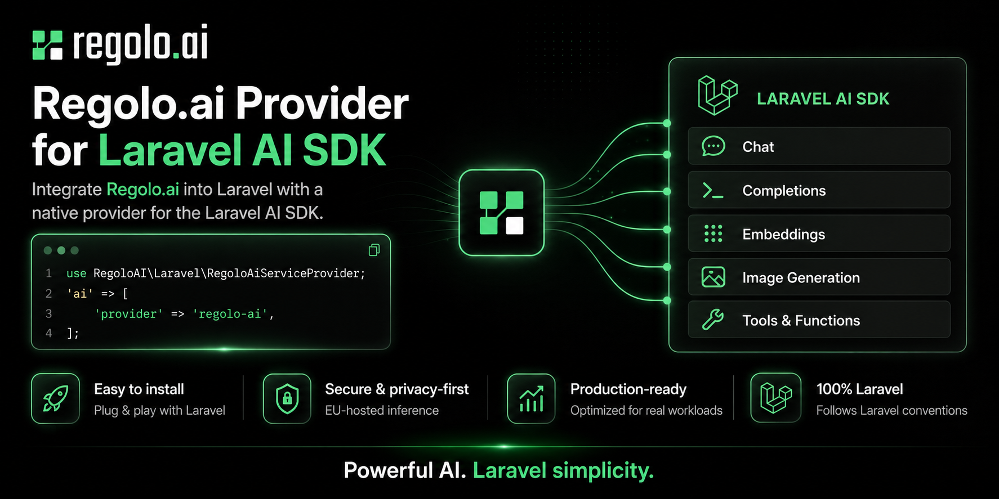
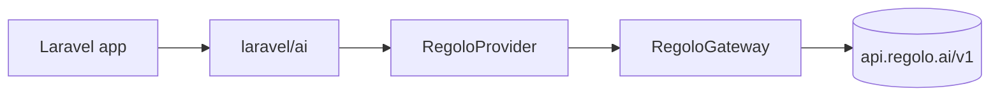

# laravel-ai-regolo

`padosoft/laravel-ai-regolo` adds Seeweb Regolo to the official `laravel/ai` SDK as a normal provider. Application code keeps using Laravel AI facades while requests go to Regolo for chat, streaming, embeddings, reranking, image generation, audio transcription, and text-to-speech.



:::tip
Use this package when Laravel application prompts, documents, transcripts, or customer data must stay on Italian or EU-resident AI infrastructure.
:::

## What it gives you

| Capability | Laravel AI entry point | Regolo endpoint shape |
| --- | --- | --- |
| Chat | `Agent::for(...)->prompt()` | OpenAI classic chat completions |
| Streaming | `Agent::for(...)->stream()` | Server-sent chat deltas |
| Embeddings | `Embeddings::for(...)->generate()` | OpenAI-compatible embeddings |
| Reranking | `Reranking::of(...)->rerank()` | Cohere/Jina-shaped rerank |
| Images | `Image::of(...)->generate()` | OpenAI-compatible image generation |
| Transcription | `Transcription::of(...)->generate()` | Whisper-style transcription |
| Speech | `Audio::for(...)->generate()` | OpenAI-style speech generation |

## Minimal path

```bash
composer require laravel/ai
composer require padosoft/laravel-ai-regolo
```

```php
use Laravel\Ai\Agent;

$response = Agent::for('Dimmi tre cose su Roma.')
    ->using('regolo', 'Llama-3.3-70B-Instruct')
    ->prompt();

echo $response->text;
```

## Documentation map

- Start with [Installation](get-started/installation.md), [Quick Start](get-started/quick-start.md), and [Configuration](get-started/configuration.md).
- Use [Chat And Streaming](guides/chat-and-streaming.md), [Embeddings](guides/embeddings.md), [Reranking](guides/reranking.md), and [Multimodal](guides/multimodal.md) for feature work.
- Read [Motivazione](concetti/motivazione.md), [Teoria](concetti/teoria.md), and [Design](architettura/design.md) before changing package internals.
- Keep [Live Verification](operations/live-verification.md), [Troubleshooting](operations/troubleshooting.md), and [Release Checklist](operations/release-checklist.md) close during releases.


